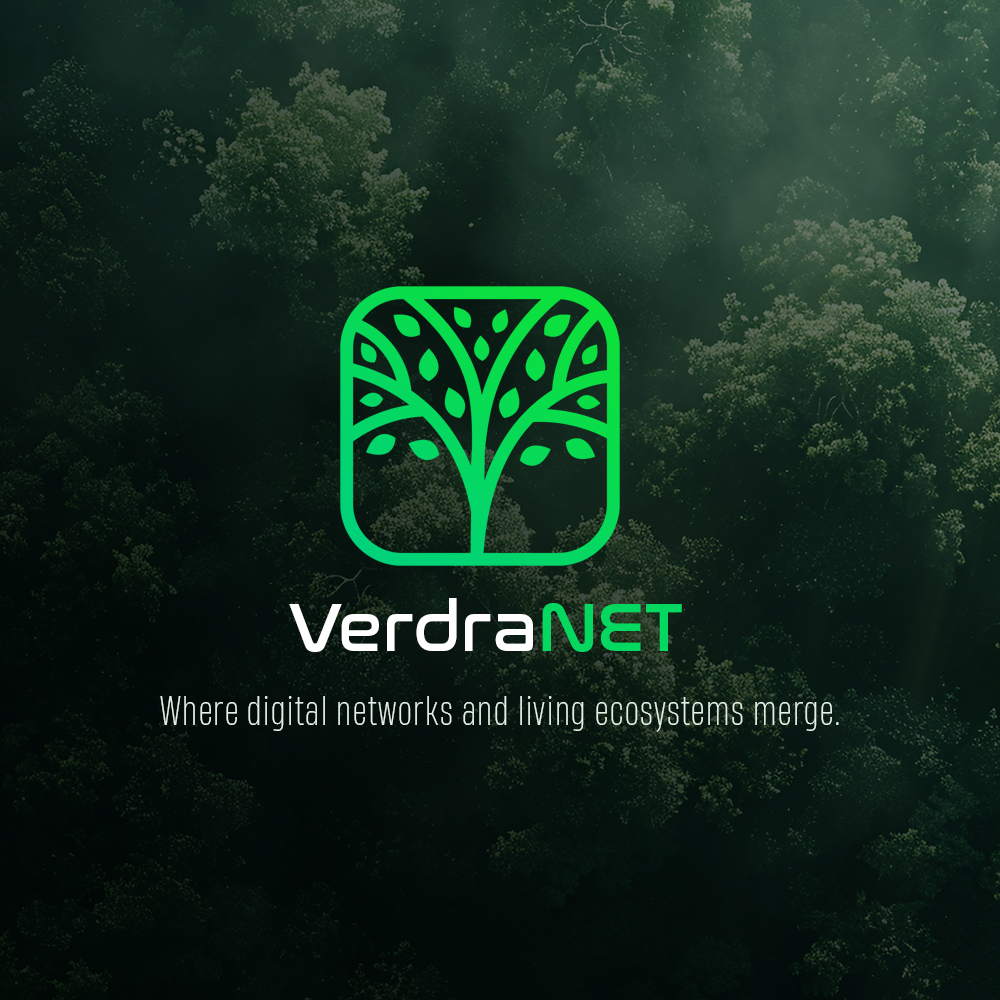

<div align="center">
  
  <h1>VerdraNET</h1>
  <p><strong>Where digital networks and living ecosystems merge.</strong></p>
  <a href="https://verdranet.com">https://verdranet.com</a>
</div>

---

VerdraNET is an open-source carbon and reforestation data network.  
It bridges on-chain transparency with real-world environmental action.

### 🌱 Overview
- **Proof-of-Plant Protocol:** Immutable, GPS-tagged reforestation records.
- **TreeNFT Registry:** Each planted tree is represented by a verifiable digital token.
- **Carbon Oracle:** Calculates dynamic CO₂ sequestration using NDVI and growth models.
- **VerdraVault Treasury:** Manages offset pools and automated revenue routing.

### ⚙️ Stack
| Layer | Tech |
|-------|------|
| API | Node.js / Express |
| SDKs | TypeScript + Python |
| Dashboard | React (Vite) |
| Smart Contracts | Solana Rust (program stubs) |
| Data | JSON (mock telemetry) |

### 🧩 Key Components
```
/api           → REST API for telemetry + mint flows
/webapp        → Dashboard with analytics + explorer tab
/sdk/js        → JS SDK for developers
/sdk/python    → Python SDK for automation
/contracts     → Solana stubs (TreeNFT, VerdraVault)
/cli           → Python CLI tools
/docs          → Protocol + API specifications
```

### 🔗 Live Link
Visit **[verdranet.com](https://verdranet.com)** for more context, documentation, and the roadmap.

### License
MIT © 2025 VerdraNET
